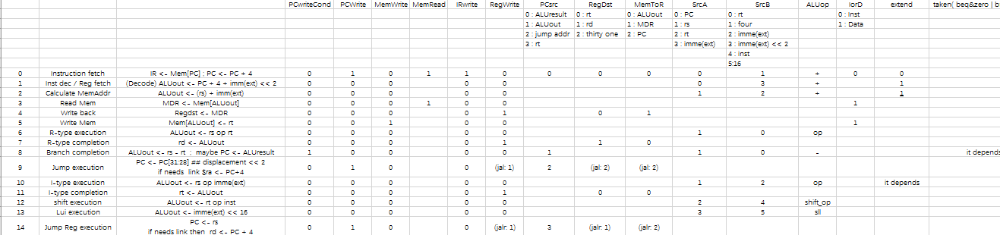
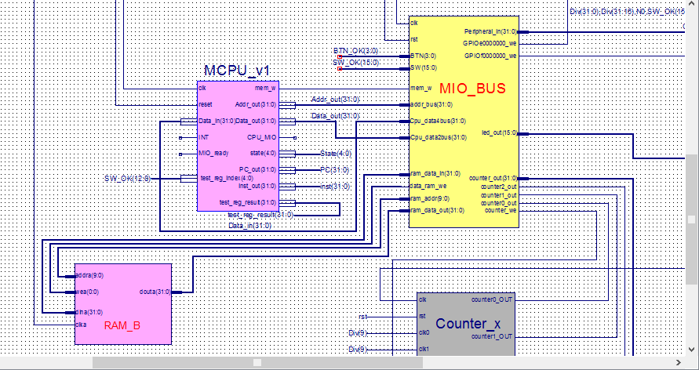

# 1. OVERVIEW
*MultipleCycleCPU*, as its name reveals, is a **hardware program** that simulate the behavior of a  trivial **multiple cycle CPU**.
As a homework assigned in the **computer organization** course for sophomore majoring in CS,
it is an **individual project** for **non-comercial** purposes.  
# 2. TASK INTRODUCTION
1. Design the Datapath, bring together the basic units into Single-cycle clock CPU  
2. Implement at least 18 instructions: Add, Sub, And, Or, Lw, Sw, Slt, Beq, J, etc  
3. Better implement the 23 or more instructions: Lui, Jr, Jal, Jalr, etc  
4. Verify the CPU with program and observe the execution of the program  
5. Achieve the same performance as we obtain in the experiment of single-cycle CPU   
# 3. DESIGN PRINCIPLES
1. Data path  
According to the instruction in PPT and the textbook, I design my data path for my multiple-cycle CPU shown as follows:   
  
2. State Figure  
We will use finite state machine model to implement MCPU. And my design can be seen as follows:  
  
3. Control signals for MCPU  
Now we can have a look at the interface of my SCPU, and the relationship between the SPCU and its neibours.  
  
4. Interface for MCPU
Now we can have a look at the interface of my MCPU, and the relationship between the MPCU and its neibours.  
  

# 4. TESTING RESULT
Everything went well in the following four tests:
## LED Banner
  
## Number traversal
  
## Timer
  
## Rectangle change
  

# 5. LICENSE
The content of all the codes are supposed to use a licence [AGPLv3](./LICENSE)  

# 6. HOW TO CONTRIBUTE
1. Learn what is a AGPLv3, if you have not yet done so (see details above).  
2.  Create your change to the repo in question.
- Fork the desired repo, develop and test your code changes.
- Ensure that your code is clear and comprehensible.
- Ensure that your code has an appropriate set of unit tests which all pass.
3. Submit a pull request.
4. The repo owner will review your request. If it is approved, the change will be merged. If it needs additional work, the repo owner will respond with useful comments.

# 7. CREDIT
First of all, I would like to extend my sincere gratitude to my supervisor, Xiaohong Jiang, for her instructive advice and useful suggestions on my learning on computer organization.   
I am also deeply grateful of Zhe Pan, the TA's help in the completion and assessment of this project.  
High tribute shall be paid to Licheng Guo, whose profound knowledge of CPU and Verilog HDL triggers my inspiration for this brilliant project. 
